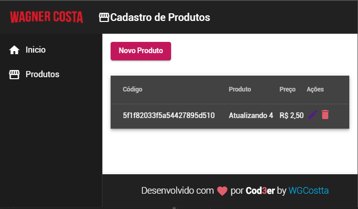

 
## Wagner Costa :nerd_face:

## Seja bem-vindo ao meu perfil

Meu nome é Wagner Oliveira da Costa e sou desenvolvedor Full-Stack

 :blue_heart: Apaixonado por Tecnologia
 :coffee: Delphi, Java, PHP, Python, Spring
 :star_struck: Angular, Flutter, VueJS

>>> [Projeto em Angular CLI - Versão 9](https://angular-9-crud-front-and-back-end-cod3er.vercel.app) disponível para testes. <<<

Repositórios: [Frontend:](https://github.com/wgcostta/angular-9-CRUD-frontAndBackEnd-Cod3er) Angular e [Backend:](https://github.com/wgcostta/node-express-backend-mongoDB-online) Node com Express e banco de dados MongoDB:

  
  

